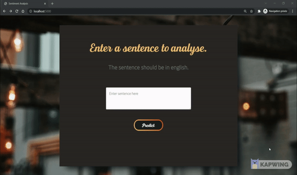

<h1 align="center">Data Engineering project</h1>

   <strong> Dockerized web interface for sentiment analysis </strong>

  Project of a group of 2 persons at EFREI Paris for the Data Engineering course.

 

  <!-- Maintenance -->
    
  <!-- Last Commit -->
  
  <!-- Activity -->
  
  <!-- PR -->
  <!--  
  <!--    alt="pulls" />-->
  <!-- Size -->
    

 

### Project organization :  

<pre><code class="language-nohighlight">
├── README.md               &lt;- The top-level README for developers using this project.
├── data                    &lt;- Dataset used to measure the model accuracy. Found at : https://www.kaggle.com/marklvl/sentiment-labelled-sentences-data-set
│   └── labelled_sentence.csv   
│   
│
├── static                  &lt;- The folder containing the css files.
│      └── css       
│ 
├── templates               &lt;- The folder containing the html files.
│
├── docker-compose.yaml     &lt;- The docker compose properties to define the multi-container docker application. <strong> The port used is "5000" </strong>
│
├── Dockerfile.dockerfile   &lt;- The docker image for the application.
│
├── requirements.txt        &lt;- The requirements for the Docker image <strong>[flask,nltk,vaderSentiment,requests].</strong>
│
├── web_app.py              &lt;- The python script to define the web application and link it to the model.
│
└── test_web_app.py         &lt;- The python script for unit and integration testing.

</code></pre> 

On Github, several branches were created during the project and were deleted when merged.

* __web_app__ : to design the html and css and render a first web application.
* __model_app__ : to add the model, its prediction and link it to the web application.
* __testing__ : to do the testing parts.
* __documentation__ : to work on the documentation.

### Demonstration : 

 To start the application, run <strong>docker-compose up</strong> at the root of the projet. The application is now running at <em>localhost:5000</em>

<h2> When entering a positive sentence : </h2>  
  
<h2> When entering a negative sentence : </h2>  

### Performed tests :

Here are the test that we performed in test_web_app.py : 

* Is the application working for "/" route and "/predict" post route.
* Is the get route for "/predict" redirecting corretly.
* Is the application rendering the correct html page.
* Several sentence were tested to see if the prediction was correct.
* Stress testing of the home page and the prediction page.
* Accuracy testing of our back-end model.

### Project Management :  

A Trello was created to coordinate the tasks between the team members.

  
  

<strong> Languages and Tools: </strong>

 

 

  Project made by
  <a href="https://github.com/Duramann">Théo Dura</a>,
  <a href="https://github.com/plao1996">Philippe Lao</a>,
  </a>

